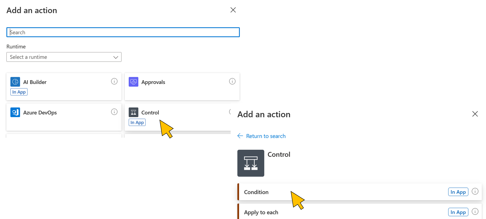
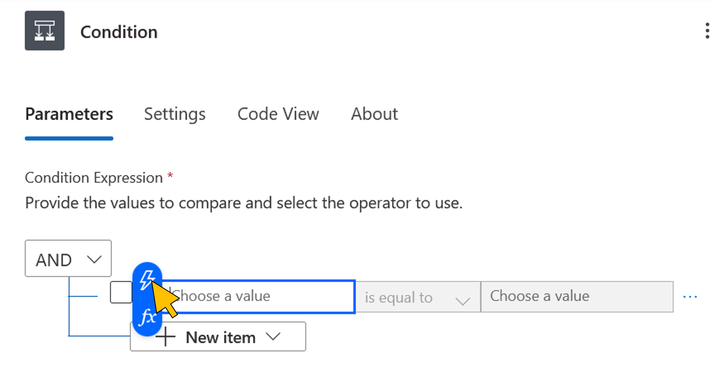
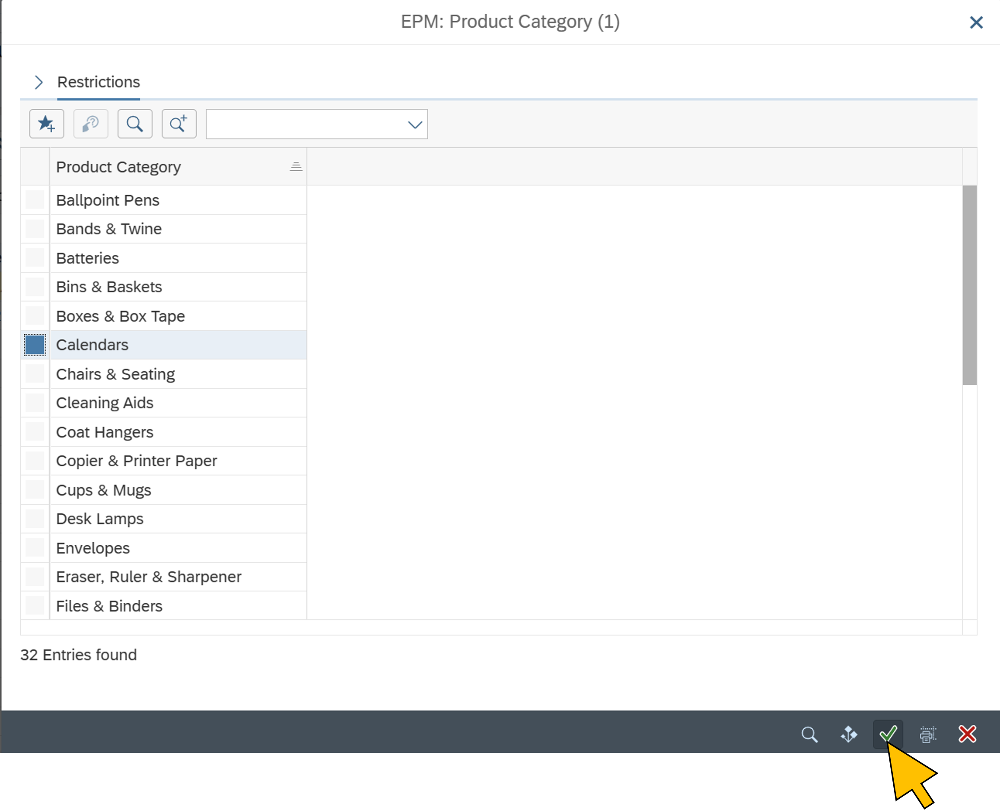
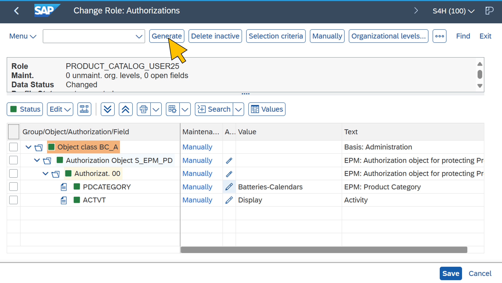

# Hands-on lab for the SAP Product Search Copilot

## Solution architecture

Edit `C:\Windows\System32\drivers\etc\hosts`
40.69.209.245 vhcals4hci.dummy.nodomain vhcals4hci

## Exercise 1: Launch the SAP Product Search Copilot

| Step | Description | Screenshot |
| ----------- | ----------- | ----------- |
| 1.1 | Sign in to [Copilot Studio](https://copilotstudio.microsoft.com/) as `user<N>@bestruncorp.onmicrosoft.com` |  |
| 1.2 | Switch to your user‘s environment `bestruncorp_user<N>` |  |
| 1.3 | Open the SAP Product Search Copilot |  |
| 1.4 | Select **Settings > Channels** |  |
| 1.5 | Click **Demo website** |  |
| 1.6 | Copy the URL |  |
| 1.7 | Open the demo website in a private browser window. Click **Login** |  |
| 1.8 | Login to the Copilot as `user<N>@bestruncorp.onmicrosoft.com` |  |
| 1.9 | Copy the login validation code |  |
| 1.10 | Send the code |  |
| 1.11 | Start the conversation e.g. by typing *„Hi! How do I get started?“* until you run into an error |  |

## Exercise 2: Troubleshoot the SAP access in Power Automate

| Step | Description | Screenshot |
| ----------- | ----------- | ----------- |
| 2.1 | Open [Power Automate](https://make.powerautomate.com/) in a new browser tab |  |
| 2.2 | Switch to your user‘s enviornment `bestruncorp_user<N>` |  |
| 2.3 | Select **Solutions > SAP Product Search Copilot** |  |
| 2.4 | Select **Cloud Flows > Chat with Azure OpenAI** |  |
| 2.5 | Select the last failed instance from the run history |  |
| 2.6 | Browse to the failed action in the instance trace |  |
| 2.7 | Check the „innerError“ message |  |

## Exercise 3: Fix the login error in SAP

| Step | Description | Screenshot |
| ----------- | ----------- | ----------- |
| 3.1 | Click **Edit** |  |
| 3.2 | Scroll down and click on **+ > Add an action** below the action `Parse response message for action` |  |
| 3.3 | Select **Control > Condition** |  |
| 3.4 | Click on the **Flash** icon |  |
| 3.5 | Select **Body action** from the `Parse response message for action` |  |
| 3.6 | Select **is not equal to** |  |
| 3.7 | Enter *none* in the value field |  |
| 3.8 | Click **Collapse** |  |
| 3.9 | Click on **+ > Add an action** in the *True* path |  |
| 3.10 | Enter *Run a child* in the search bar and select **Run a Child Flow** from the list |  |
| 3.11 | Select **Exchange Token** from the list in **Child Flow** field |  |
| 3.12 | Click on the **Flash** icon in the **EntraIDToken** field |  |
| 3.13 | Select the **EntraIDToken** data element from the **Run a flow from Copilot** Trigger |  |
| 3.14 | Rename the action to *Exchange Entra ID Access Token for SAP Access Token* and click **Collapse** |  |
| 3.15 | Scroll down and select the SAP data access action **Get all products the user has access to from SAP** from the switch **List categories** case |  |
| 3.16 | Delete the placeholder text *<fix missing token here>* in the **Authorization** Headers field. Type in *`Bearer<Space>`"* and click on the **Flash** icon |  |
| 3.17 | Scroll down and select the **SAPToken** data element from the **Exchange EntraID Access Token for SAP Access Token** action |  |
| 3.18 | Click **Collapse** |  |
| 3.19 | Repeat the steps **3.15** to **3.18** for the two remaining actions **Get all products for a category from SAP** and **Get product details from SAP** |  |
| 3.20 | Click **Save draft** |  |
| 3.21 | Wait for the save operation to complete, then click **Publish** |  |
| 3.22 | In Copilot Studio, go to **Topics > System**, and select the **Fallback** topic |  |
| 3.23 | Scroll down to the action where the **Chat with Azure OpenAI** flow is called. Click **Select Variable** on the **EntraIDToken** input field |  |
| 3.24 | Select the **System** tab and select **User.AccessToken** from the list |  |
| 3.25 | Click **Save** |  |
| 3.26 | Go to **Publish** and click **Publish** |  |

## Exercise 4: Test SAP data access with the fixed flow

| Step | Description | Screenshot |
| ----------- | ----------- | ----------- |
| 4.1 | Go back to the demo website and click *Start over* |  |
| 4.2 | You may need to re-login to the copilot |  |
| 4.3 | Start the conversation |  |
| 4.4 | Continue until you get the details of a product you are interested in |  |

## Exercise 5: Change the user‘s authorizations in SAP

| Step | Description | Screenshot |
| ----------- | ----------- | ----------- |
| 5.1 | Access the SAP system as user `USER<N>ADM` with the [SAP Web GUI](https://vhcals4hci.dummy.nodomain:44300/sap/bc/gui/sap/its/webgui) |  |
| 5.2 | Enter transaction code `PFCG` (Role Maintenance) and hit **Return** |  |
| 5.3 | Enter *`PRODUCT_CATALOG_USER<N>`* in the **Role** field and hit the **Edit** button |  |
| 5.4 | Switch to tab **Authorizations** and click **Change Authorization Data** |  |
| 5.5 | Expand the authorization object tree and click the **Edit** button for the *PDCATEGORY* authorization field |  |
| 5.6 | Click on the **value help** button of the **'From'** field |  |
| 5.7 | Select a different product category, e.g. *Batteries*, and confirm with **OK** |  |
| 5.8 | Also change the **'To'** field by clicking on the **value help** |  |
| 5.9 | Change the value, e.g. to *Calendars*, and click **OK** |  |
| 5.10 | Click **Save** |  |
| 5.11 | Click **Save** |  |
| 5.12 | Click **Generate** |  |
| 5.13 | Click **Exit** |  |
| 5.14 | Back on the Demo website, click **Start over** |  |
| 5.15 | Ask the copilot again from which categories you can choose from to see the changes made in the backend |  |